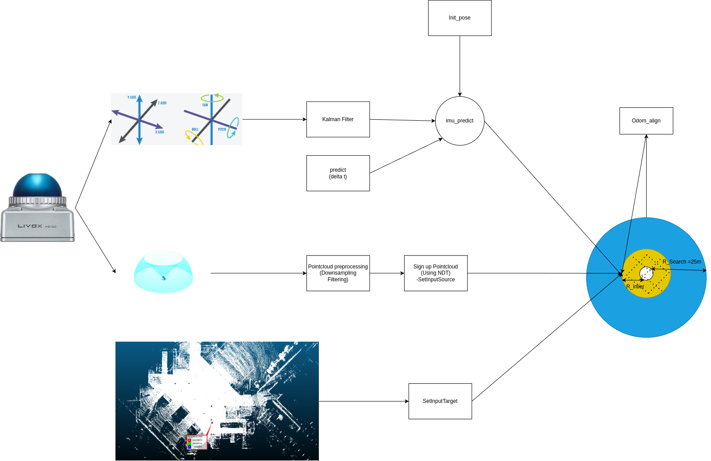
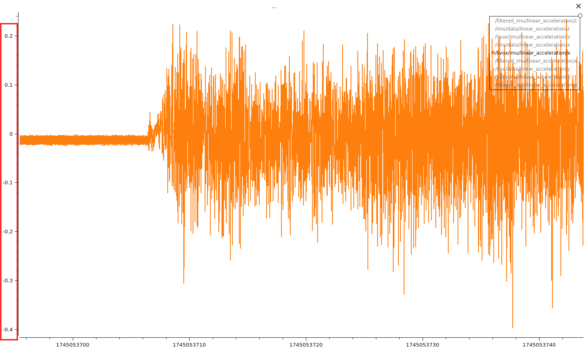
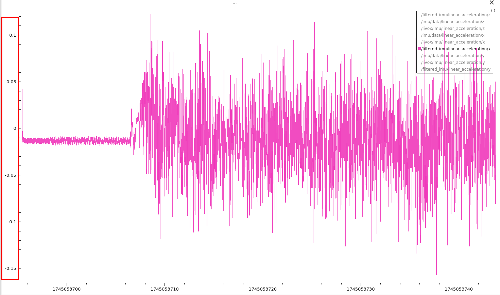
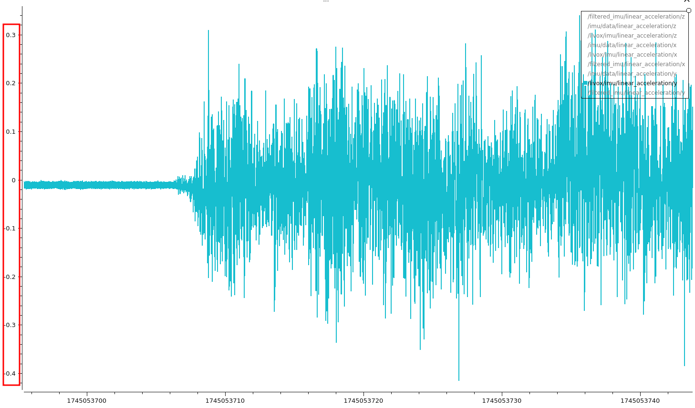
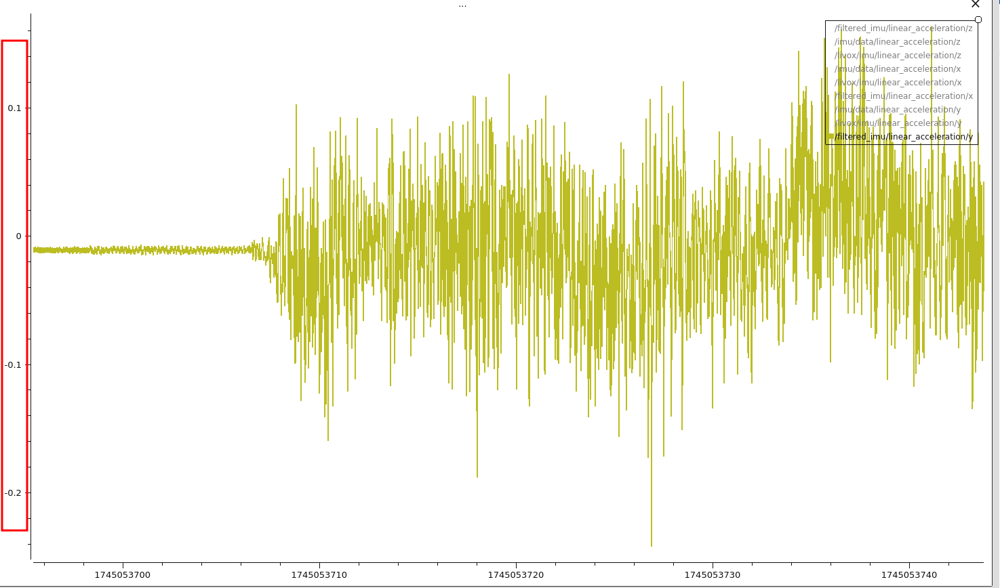
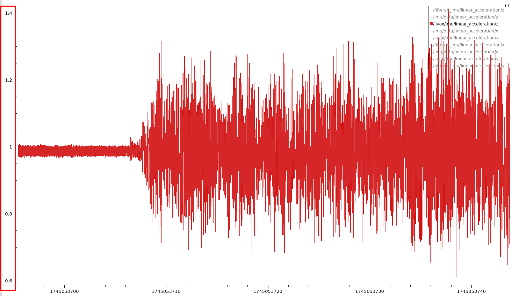
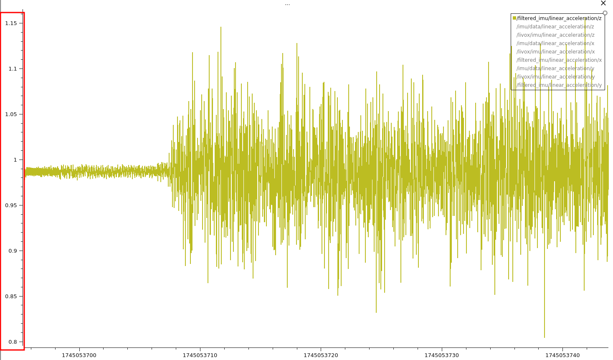

# **Localization indoor for Robot** 😊
## 🎯 **Target **
- ✅ Supports Lidar & IMU based positioning   
- ✅ Integrated Kalman/Madgwick filter   
- ✅ Easy to extend and fine-tune parameters  

---

## 🔧 **Cài đặt**
### **1. Yêu cầu hệ thống**
```bash
Requires the following libraries:
 - PCL
 - OpenMP
```
## 🔧 **Installation**
```bash
git clone https://github.com/Khanh-embedded247/Localization_Indoor.git
cd Localization_Indoor
```
## 🔧 **Setup dependencies**
```bash
sudo apt-get update
chmod +x install_dependencies.sh
./install_dependencies.sh
```

## 🖥️ **Compile the project**
```bash
catkin_make
source devel/setup.bash
```
## 🚀 **RUN project**
```bash
roslaunch hdl_localization hdl_localization.launch
```

## 🎯 **System architecture**


## 📌 **Note**
During testing, I experimented with raw IMU data from **Bno0555 (50Hz)** and **Livox IMU (200Hz)**. Based on the promising results and the high demand for stable data processing in robotics applications, I decided to utilize the IMU inside **Livox MID 360**.

To enhance stability and minimize errors, I implemented a **simple Kalman Filter algorithm** with three key parameters:

- **`process_noise = 0.95`**: Describes the level of random changes in the system. A higher value makes the filter respond faster to new data but reduces stability.
- **`measurement_noise = 0.075`**: Defines the reliability of measurements from the IMU sensor. A higher value makes the filter trust the prediction model more than the sensor readings.
- **`initial_covariance = 0.01`**: Represents the initial uncertainty about the system state.

Depending on your specific system and sensor characteristics, you may need to **fine-tune these parameters** to achieve optimal performance.

---

|                  IMU RAW                   |                   IMU Livox                      |
|--------------------------------------------|-------------------------------------------------|
| |   |
| |   |
| |   |

** My bag file path you can try: https://drive.google.com/drive/folders/1XvqFGADkBGucOlEoj_kxD0VdvAb8tRpA?usp=drive_link .

## 📞 **Contact**
```bash
📧 Email: khanh191600560@gmail.com  
🔗 GitHub: https://github.com/Khanh-embedded247 
💬 Facebook: https://www.facebook.com/K.h.a.n.h.24.7

```